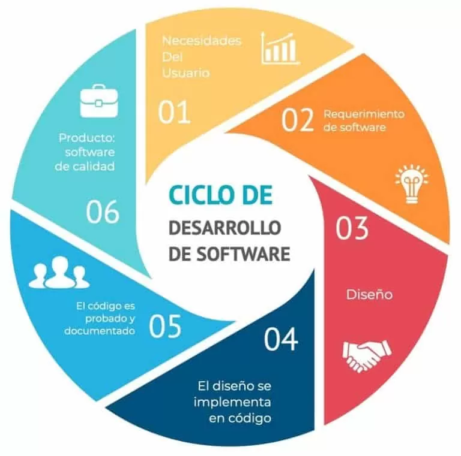

# **¿Qué es un programa informático?**

### Un programa informático es un conjunto de instrucciones que indican a un ordenador qué acciones debe realizar para llevar a cabo una tarea determinada.

Estas instrucciones están escritas utilizando un lenguaje de programación, como Python, Java, C o C++. Una vez que el programa ha sido traducido a un formato que el ordenador puede interpretar, puede ejecutarse para realizar las funciones para las que ha sido diseñado.

Algunos ejemplos de programas informáticos son los navegadores web, los procesadores de texto, los videojuegos y las aplicaciones móviles.

# **Diferencia entre código fuente, código objeto y código ejecutable.**

## Código fuente

### El código fuente es el conjunto de instrucciones que escribe un programador utilizando un lenguaje de programación.

## Código objeto

### El código objeto es el resultado de la traducción del código fuente realizada por un compilador.

Está formado por instrucciones en un formato más cercano al lenguaje que entiende el ordenador. Normalmente, todavía puede necesitar otros procesos para convertirse en un programa ejecutable.

## Código ejecutable

### El código ejecutable es el código que puede ser ejecutado por el sistema operativo para que el programa realice sus funciones.

# **Etapas del desarrollo software**

## El desarrollo de software está formado por diferentes etapas. Las principales son:

- **Análisis de requisitos:** se identifican las necesidades y los objetivos que debe cumplir el programa.
- **Diseño:** se planifica la estructura del software y la forma en la que funcionarán sus diferentes componentes.
- **Implementación:** los programadores escriben el código necesario para desarrollar el programa.
- **Pruebas:** se comprueba que el programa funciona correctamente y se buscan posibles errores.
- **Despliegue:** el software se instala o se pone a disposición de los usuarios.
- **Mantenimiento:** se corrigen errores, se realizan mejoras y se añaden nuevas funcionalidades.

## Imagen

## Enlace a mi repositorio

[Mi repositorio en GitHub](https://github.com/Naelfdz/1DAMV_FernandezLuelmo_Nael)
